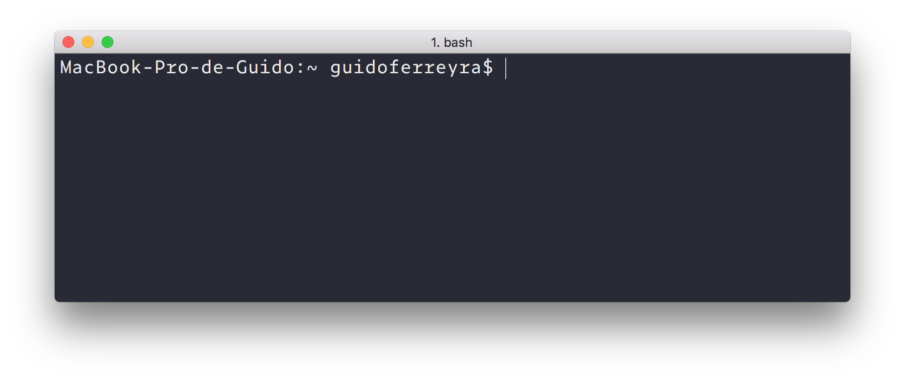
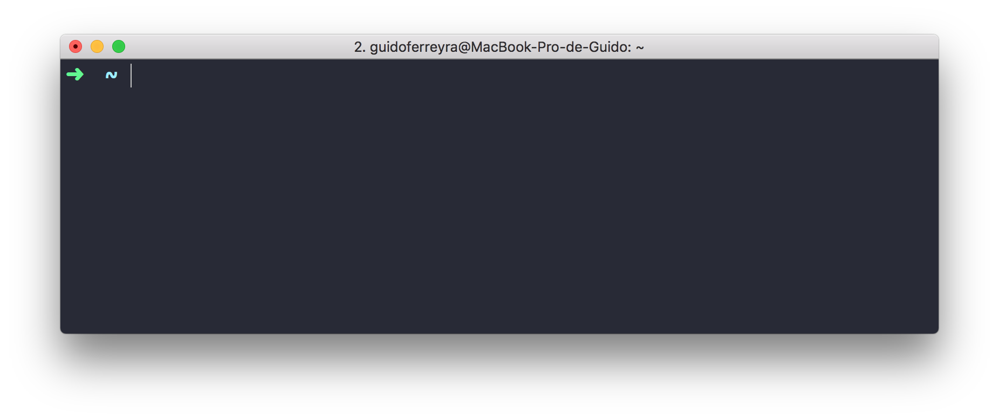
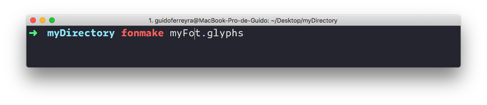
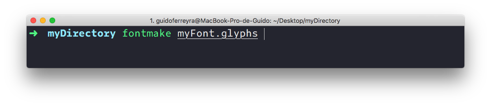

# Command line tools intro

Most of the time that we are using our computers we are operating them trough a graphical user interface (GUI), alternatively operating systems provides an interface based only on inputing texts in a terminal, this is the command line interface (CLI). By using it we not only could operate the operating system functions but also use a lot of third-party tools that can be really helpful and pretty vital in a font production workflow. 

At the beginning, the use of this interface can be a little intimidating but after understanding some basic concepts it becomes a really useful and a performant way to do some tasks. Personally, I strongly recommend to spend some time configuring how the terminal looks, in my case it helped me a lot to get confortable with the CLI.

There is a common idea that using the terminal without you being an expert can break your computer, I think is really hard to crash your computer unless you are messing with the operating system files, so I don’t think we should be afraid of using it.

# First Steps

1. Open your Terminal app of preference. You will notice a `~` in the prompt, this represents the home folder of your computer.
2. Alternatively we can type the command `pwd`  to see in what directory we are right now.
3. `ls`  will list all the directories and files  inside de current directory.
4. `cd`  (_change directory_)  it used to move us to another directory. A few examples here:
   - `cd Desktop` (Using a relative path to our current directory)
   - `cd /Users/guidoferreyra/Documents/Arduino` (using an absolute path to a directory in our computer) 
     Tip: By drag and dropping directories to our terminal window it will paste the absolute path to it.
   - `cd ~` Will lead us to the _home_ directory of our computer.
5. `clear` cleans the terminal window to get clarity after being inputing various commands.
6. `touch` It creates a file. For instance with `touch myFile.txt` it will create a .txt file in the current directory.
7. `open myFile.txt` Opens the file in the default app associated with this filetype.
   The `-a  ` argument allows us to specify with which application we want to open the file. ie: `open -a "Pages" myFile.txt` 
8. With the _Up_ arrow key of our keyboard we can navigate trough our history of commands typed in the terminal.
9. The `history` command will print our history in the terminal window.
10. To remove a file we use `rm myFile.txt ` 
11. `mkdir myFolder ` It will create a directory
12. `rm -r myFolder` (_remove recursively_) removes the directory and its contents.

# Installing tools

As I mentioned before there is a lot of tools you can install and use trough the CLI. Commonly you will be installing them via a package manager like [Homebrew](https://brew.sh/) or [Pip](https://pypi.org/). A package manager is a software that simplifies the installation, updating and removal of softwares (maybe I can say its like the App Store). When installing tools that are written in Python is better to do it inside a virtual environment. See more [here](1_setup-a-Python-virtual-environment.md) .

# A short list of tools

Here below a short list of tools commonly used on font production. I strongly encourage you to read the tools documentation and usage instructions:

- [FontTools/TTX](https://fonttools.readthedocs.io/en/latest/) — Convert binaries to and from a XML human readable format, subset fonts, and more.
- [AFDKO](https://github.com/adobe-type-tools/afdko) — Build fonts, create proofs, autothint, and more.
- [fontmake](https://github.com/googlefonts/fontmake) — Build fonts from various sources very useful for variable fonts:
- [fontbakery](https://font-bakery.readthedocs.io/en/stable/) — Create QA reports from fonts
- [TTFAutohinting](https://www.freetype.org/ttfautohint/) — TrueType autohinting
- [Fontlang](https://github.com/rosettatype/langs-db),  Rosetta Type Database of languages — Get the language support from a font


# Tune up your terminal (optional)

The following instruction are totally optional, the default Terminal app and its configuration is perfectly fine to work with it, I personally recommend this "enhancements" because it makes the experience a lot more smoother.

1. **Choose you terminal application:** Like any other app there are a few alternatives, personally I prefer [iTerm](https://www.iterm2.com/) over the Terminal app that is shipped with Mac OS.

2. **Choose your command interpreter:** By default **bash** is the default command interpreter in Mac OS versions before catalina, alternatively I recommend use **zsh** because it has better autocompletetion, command history and the possibility to be customized and extended with plugins. To set zsh as the default interpreter you can use this command:

   ```
   chsh -s /bin/zsh
   ```

   When executing this command you will be asked to enter your administrator password.

3. **Install Oh My Zsh**  [Oh my Zsh](https://ohmyz.sh/) its a framework that allows us to configure the appearance of our prompt and the use of different plugins that improves the legilibilty and the overall experience. You can install with the following command:

   ```
   sh -c "$(curl -fsSL https://raw.github.com/ohmyzsh/ohmyzsh/master/tools/install.sh)"
   ```

   

4. I recommend to install the plugin [zsh Syntax Highlighting](https://github.com/zsh-users/zsh-syntax-highlighting) that give us live visual feedback when we are typing commands. This helps us to avoid typos and to get used faster to the command line syntax. In the image you can see how the text is colored in red when the command is not found, in this case because it was typed wrongly.
   
   Or in green when the command is valid and also the underline when the inputed path is effectively pointing to a file.
   

